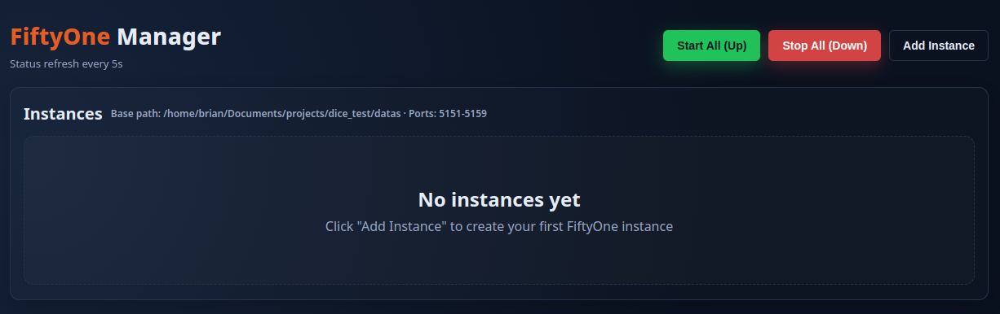
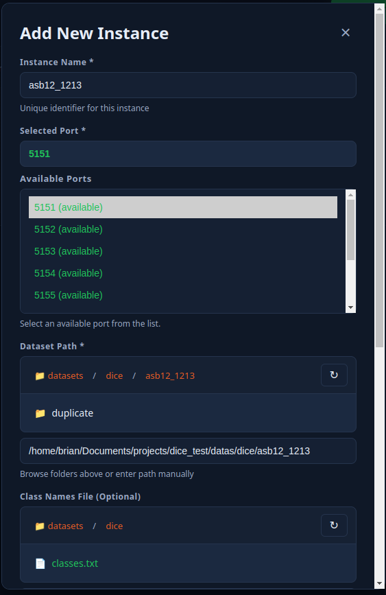
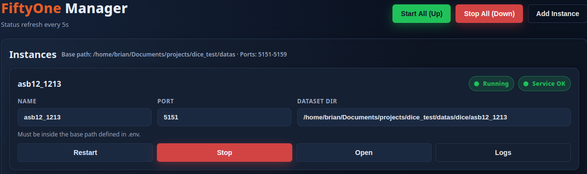
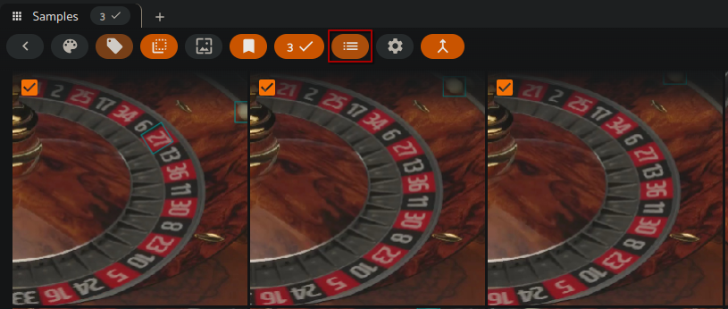
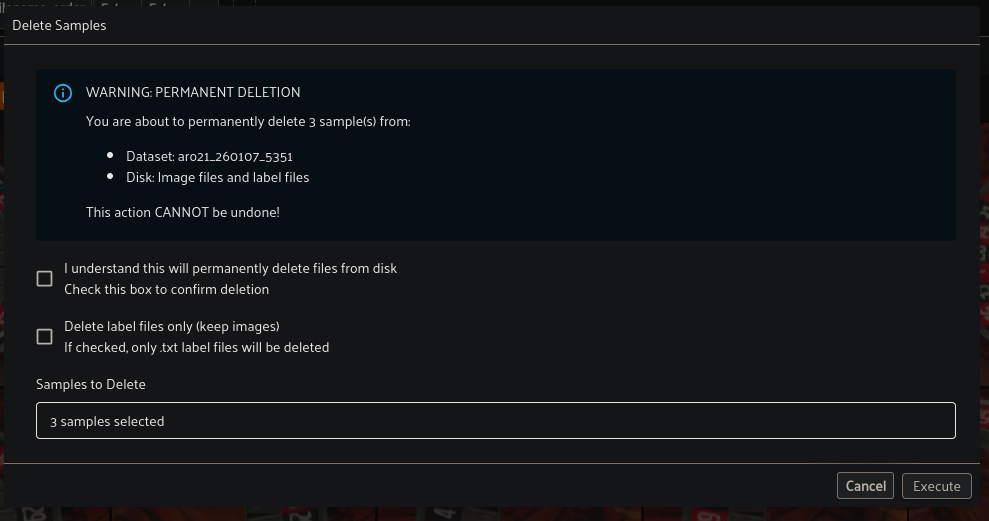
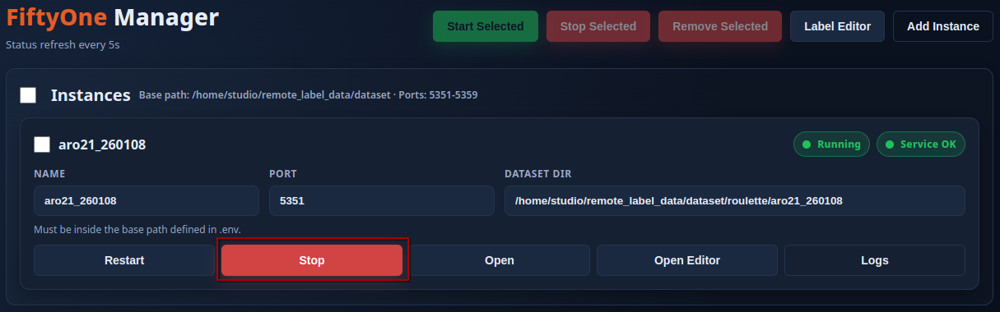
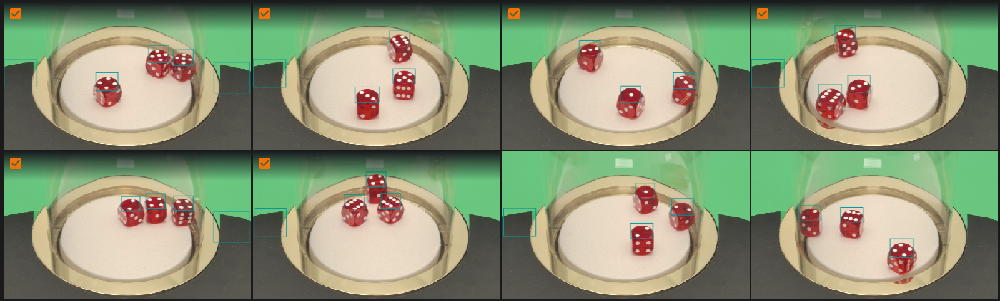
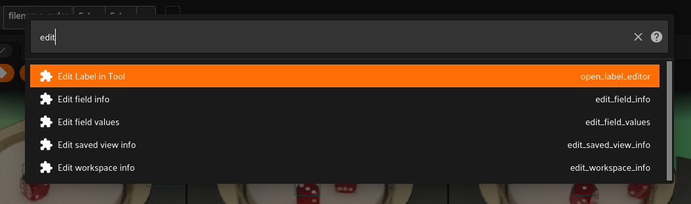
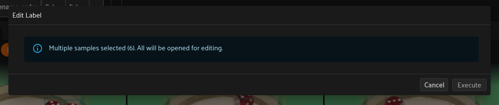
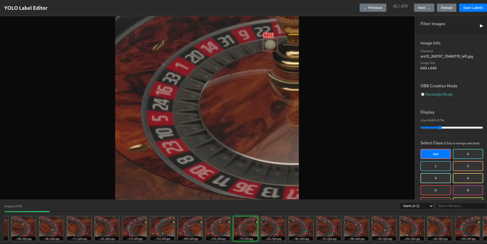

# FiftyOne Manager 使用手冊

> 資料集管理與標籤編輯簡明指南

## 📋 目錄

1. [系統介紹](#系統介紹)
2. [管理實例](#管理實例)
3. [瀏覽資料集](#瀏覽資料集)
4. [編輯標籤](#編輯標籤)
5. [常見問題](#常見問題)

---

## 系統介紹

FiftyOne Manager 提供以下功能：

- **管理多個 FiftyOne 實例** - 同時開啟多個資料集
- **瀏覽和檢視資料集** - 視覺化圖片和標註
- **編輯 YOLO 標籤** - 直接修正標註錯誤
- **智慧去重** - 自動偵測重複圖片

### 存取系統

在瀏覽器開啟管理介面（向系統管理員取得網址）：
```
http://192.168.20.9:5050
```

---

## 管理實例

### 新增實例

1. 點擊 **「+ 新增實例」**(+ Add Instance)


2. 填寫必要資訊：

| 欄位 | 說明 | 範例 |
|------|------|------|
| **實例名稱** (Instance Name) | 給實例取一個容易辨識的名字。只能使用英文、數字、底線和連字號。名稱不可重複。 | `骰子資料集_1106`<br>`dice_test_001` |
| **連接埠** (Port) | FiftyOne 服務運行的埠號。系統會自動建議可用的埠號（通常是 5151-5160）。每個實例需要不同的埠號。 | `5151`<br>`5152` |
| **資料集路徑** (Dataset Path) | 資料集所在的完整路徑。必須包含 `images/` 和 `labels/` 兩個子資料夾。可以點擊「瀏覽」(Browse) 按鈕選擇，或手動輸入絕對路徑。 | `/data/datasets/dice/1106`<br>`/home/user/datasets/mydata` |
| **類別檔案** (Class File) | 定義物件類別名稱的文字檔。每行一個類別名稱，順序對應類別 ID（從 0 開始）。可選填，若不指定則使用預設類別。選擇後會顯示預覽。 | `classes.txt`<br>`dice_classes.txt` |
| **重複閾值** (Duplicate Threshold) | 去重檢測的相似度標準（0.0-1.0）。數值越低越嚴格，只有非常相似的才算重複。 | `0.25` |
| **除錯模式** (Debug Mode) | 開啟後，重複圖片會依群組分類到不同資料夾。關閉時，所有重複圖片會放在同一個資料夾。一般使用者建議關閉。 | ☐ 不勾選（預設） |
| **自動同步標籤** (Auto Sync Labels) | 在標籤編輯器儲存時，自動同步標籤到 FiftyOne。 | ☑ 勾選（建議） |
| **OBB 格式** (OBB Format) | 將 YOLO 邊界框轉換為 OBB 格式（4 個點，從左上角順時針排列）。適用於旋轉標註。 | ☑ 勾選（如需旋轉標註） |
| **OBB 建立模式** (OBB Creation Mode) | 建立 OBB 標註的方式：<br>• **Rectangle (Drag)** - 拖曳繪製矩形<br>• **Polygon (4 Points)** - 點擊 4 個點繪製多邊形 | `Rectangle (Drag)` |

### 資料集結構要求

資料夾必須包含 `images/` 和 `labels/` 子資料夾：

```
您的資料集/
├── images/       # 圖片檔案
│   ├── img001.jpg
│   └── ...
└── labels/       # YOLO 標註檔案
    ├── img001.txt
    └── ...
```

### 啟動與操作

**頂部工具列（批次操作）**：
- **Start Selected** - 啟動選取的實例
- **Stop Selected** - 停止選取的實例
- **Remove Selected** - 移除選取的實例（不會刪除資料集檔案）
- **Label Editor** - 開啟標籤編輯器資料集選擇視窗
- **Add Instance** - 新增實例

**Label Editor Datasets 視窗**：

點擊 **Label Editor** 按鈕後會開啟資料集選擇視窗，顯示所有可用的實例：
- 每個實例會顯示名稱、狀態、資料集路徑和連接埠
- **Open Label Editor** - 直接開啟該實例的標籤編輯器
- **Copy URL** - 複製標籤編輯器的 URL 到剪貼簿

💡 **提示**：若只需使用標籤編輯器，實例不需要啟動。標籤編輯器可獨立運作，無需 FiftyOne 服務。


**實例操作按鈕**：
- **Restart** - 重新啟動實例
- **Stop** - 停止實例
- **Open** - 在新分頁開啟 FiftyOne
- **Open Editor** - 開啟標籤編輯器
- **Logs** - 查看運行狀態和錯誤訊息



### 實例狀態

| 狀態 | 說明 |
|------|------|
| 🟢 Running | 可以開啟使用 |
| ⚫ Stopped | 需要先啟動 |
| 🔴 Error | 啟動失敗，檢查日誌 |

---

## 瀏覽資料集

### FiftyOne 基本操作


**網格檢視**：
- 點擊圖片查看詳細資訊
- 調整縮圖大小

**詳細檢視**：
- `← →` 切換上/下一張
- `ESC` 返回網格檢視
- 滾輪縮放圖片

### 刪除圖片

**步驟 1：選取圖片**

在網格檢視中，點擊圖片左上角的方框來選取圖片（會顯示橘色勾選）。可以選取多張圖片。


**步驟 2：開啟操作選單**

點擊工具列上的選單按鈕（三條橫線圖示），或按 `` ` `` 鍵開啟操作選單。



**步驟 3：搜尋刪除功能**

在搜尋框輸入 `delete`，然後選擇 **Delete Samples (Permanent)**。


**步驟 4：確認刪除**

系統會顯示警告對話框：
- 顯示將刪除的樣本數量和資料集名稱
- 勾選 **I understand this will permanently delete files from disk** 確認刪除
- 可選：勾選 **Delete label files only (keep images)** 只刪除標籤檔案
- 點擊 **Execute** 執行刪除



⚠️ **注意**：此操作會永久刪除圖片和對應的標籤檔案，無法復原。

### 篩選功能

使用側邊欄篩選：
- **依類別** - 只顯示特定類別的圖片
- **依標籤數量** - 顯示特定數量標註的圖片
- **依檔名** - 搜尋檔名關鍵字

### 快速鍵

| 按鍵 | 功能 |
|------|------|
| `← →` | 切換圖片 |
| `ESC` | 返回網格 |
| `F5` | 重新整理 |
| `` ` `` | 開啟操作選單 |

**macOS 補充**：
- 重新整理請用 `⌘+R`
- `` ` `` 按鍵通常與 `~` 同一顆鍵（英數輸入法）

---

## 編輯標籤

### 啟用 OBB 格式（旋轉標註）

如需使用 OBB（Oriented Bounding Box）旋轉標註功能，需先在實例設定中啟用：

**步驟 1：停止實例**

若實例正在運行，必須先點擊 **Stop** 按鈕停止實例。



**步驟 2：編輯實例設定**

點擊實例的編輯按鈕，勾選 **OBB Format (Polygon)** 選項，然後點擊 **Save Instance** 儲存。


**步驟 3：重新啟動實例**

儲存後重新啟動實例，編輯器即可使用 OBB 旋轉標註功能。

⚠️ **注意**：啟用 OBB 格式後，所有標註將轉換為 4 點格式。此操作會修改標籤檔案格式。

### 開啟編輯器

**步驟 1：在 FiftyOne 中選擇圖片**



點擊圖片進入詳細檢視模式。

**步驟 2：開啟操作選單並選擇編輯工具**




按 `` ` `` 鍵（或點擊右上角三條線的選單圖示），搜尋並選擇 **Edit Label in Tool**。

**步驟 3：確認執行**



FiftyOne 會顯示確認框，告知將開啟多少張圖片進行編輯。點擊 **Execute** (執行) 按鈕。

**步驟 4：開啟編輯器 URL**


FiftyOne 會顯示一個訊息框，包含編輯器 URL 和圖片資訊。請複製 URL，開啟新分頁後貼上進入編輯器。

**步驟 5：編輯器介面**



編輯器包含以下區域：

**頂部工具列**：
- **← Previous / Next →** - 切換上一張/下一張圖片
- **圖片計數** - 顯示當前圖片位置（例如：45 / 479）
- **Reload** - 重新載入當前圖片
- **Save Labels** - 儲存標籤變更

**右側面板**：

| 區域 | 功能 |
|------|------|
| **Filter Images** | 篩選圖片功能（點擊展開） |
| **Image Info** | 顯示檔名和圖片尺寸 |
| **OBB Creation Mode** | 顯示當前 OBB 建立模式（Rectangle Drag 或 4-Point Polygon） |
| **Display** | 調整標註線寬（Line Width 滑桿） |
| **Select Class** | 類別選擇按鈕，點擊可變更選取標註的類別 |
| **Annotations** | 標註列表，顯示每個標註的類別和刪除按鈕 |

**中央畫布**：圖片和標註框

**底部縮圖列表**：
- 顯示所有圖片的縮圖，點擊可跳轉
- 支援排序（Name A-Z）和搜尋

### 篩選圖片

展開 **Filter Images** 面板可使用以下篩選條件：

| 篩選條件 | 說明 |
|----------|------|
| **Filename** | 依檔名關鍵字篩選 |
| **Class Filter** | 依類別篩選（Any Class / Only Selected / Exclude Selected） |
| **Label Count** | 依標籤數量篩選（Min / Max） |

點擊 **Clear All Filters** 可清除所有篩選條件。

### 編輯操作

**新增標註**：
1. 在右側面板選擇類別
2. 在圖片上拖曳繪製邊界框（Rectangle 模式）或點擊 4 個點（4-Point 模式）
3. 系統會自動將點位排列為順時針順序

**刪除標註**：
- 選取標註後按 `Delete` 鍵
- 或點擊右側 Annotations 列表中的紅色 **Delete** 按鈕
- 支援多選刪除（框選多個標註後按 `Delete`）

**修改類別**：
1. 先點擊標註選中它（邊界框會變粗）
2. 然後點擊右側 **Select Class** 區域中的類別按鈕
3. 或使用 `W/S` 鍵快速切換類別

**調整邊界框**：
選中標註後，拖曳邊界框的**角落**或**邊緣**來調整大小

**旋轉標註（OBB 模式）**：
- 選取標註後，使用 `Q` 鍵逆時針旋轉、`E` 鍵順時針旋轉
- 或拖曳標註上方的旋轉控制點
- 支援多選旋轉（框選多個標註後旋轉）

**移動標註**：
選中標註後，直接拖曳邊界框即可移動位置

**多選操作**：
- 按住 `Shift` 並拖曳滑鼠可框選多個標註
- 使用 `Ctrl+Click` 可逐一加入選取
- 使用 `Ctrl+Click` 點擊已選取的標註可取消選取
- 使用 `Ctrl+A` 全選所有標註
- 框選後可同時移動、刪除、旋轉或變更類別


### 儲存變更

點擊頂部右側的藍色 **Save Labels** 按鈕儲存變更。

⚠️ **注意**：
- `Ctrl+S` 會觸發瀏覽器的「儲存網頁」功能，請使用滑鼠點擊 **Save Labels** 按鈕
- FiftyOne 不會即時自動更新標籤檔，修改後沒有立即反映是正常的
- 若啟用「自動同步標籤」，儲存後會自動同步到 FiftyOne

### 快速鍵

**導航與類別**：

| 按鍵 | 功能 |
|------|------|
| `A` 或 `←` | 上一張圖片 |
| `D` 或 `→` | 下一張圖片 |
| `W` | 切換到上一個類別 |
| `S` | 切換到下一個類別 |

**編輯操作**：

| 按鍵 | 功能 |
|------|------|
| `Ctrl+A` | 全選所有標註 |
| `Ctrl+C` | 複製選取的標註 |
| `Ctrl+V` | 貼上標註 |
| `Ctrl+Z` | 復原 |
| `Ctrl+Shift+Z` | 重做 |
| `Ctrl+S` | 儲存標籤 |
| `Ctrl+Click` | 多選標註 |
| `Q` | 逆時針旋轉選取的標註（5°） |
| `E` | 順時針旋轉選取的標註（5°） |
| `Delete` 或 `Backspace` | 刪除選取的標註 |
| `Escape` | 取消目前操作（繪製、框選） |

---

## 常見問題

### 實例無法啟動

1. 點擊 **日誌** (Logs) 按鈕查看錯誤訊息
2. 檢查常見問題：
   - 資料集路徑是否正確
   - 是否包含 `images/` 和 `labels/` 資料夾
   - 連接埠是否已被使用
3. 聯絡系統管理員

### 編輯器無法開啟

- FiftyOne 會顯示訊息框，包含編輯器 URL
- 複製 URL，開啟新分頁後貼上進入編輯器
- URL 格式：`http://伺服器IP:埠號/label-editor.html?...`

### 儲存後沒有更新

- FiftyOne 不會自動更新標籤檔，修改後沒有立即反映是正常的
- 回到 FiftyOne Manager 點擊 **Restart** 重新啟動該實例，再重新開啟 FiftyOne

### 復原重複圖片

重複圖片在 `duplicate/` 資料夾，可以手動移回：
1. 找到 `duplicate/images/` 和 `duplicate/labels/`
2. 將檔案移回 `images/` 和 `labels/`
3. 重新啟動實例

---

## 💡 使用技巧

**提高效率**：
- 使用鍵盤快速鍵
  - `W/S` 快速切換類別
  - `Delete` 刪除標籤
- 善用篩選功能
- 一次開啟多個實例處理不同資料集
- 編輯器中經常點擊 **Save Labels** 按鈕

**避免錯誤**：
- ❌ 不要同時在不同的編輯器修改同一張圖片
- ❌ 不要在實例運行時刪除資料夾
- ✅ 編輯完標籤後立即儲存
- ✅ 遇到問題先查看日誌

---

## 📚 附錄

### 取得協助

聯絡系統管理員，並提供：
1. 問題描述
2. 操作步驟
3. 錯誤截圖
4. 實例日誌

---

**記住重點**：

1. 🟢 確保實例運行中再開啟 FiftyOne
2. 💾 編輯標籤後記得儲存
3. 🔄 儲存後按 F5 重新整理
4. 📋 遇到問題先查看日誌

---
